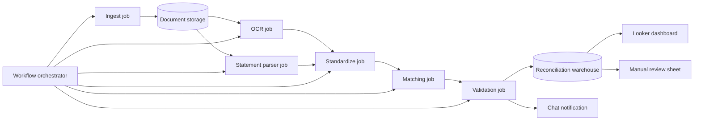

# Document Intelligence & Reconciliation

> Public case study — sanitized for portfolio use.  
> Production system source: private corporate repository.

---

## Problem

A logistics company processes thousands of bank deposits and scanned payment vouchers every week. Each deposit must be matched against an invoice or a customer reference so finance knows which payment covers which charge.

Before this system, the work was mostly manual:

- Operators downloaded bank statement files and opened scanned vouchers one by one.
- They read amounts, dates, and reference numbers by eye.
- They typed the same data into a spreadsheet.
- Mismatches and duplicates were common, and deposits could sit unmatched for days.

The company needed a pipeline that could read the documents, extract the key fields, and propose matches automatically.

---

## Solution

An end-to-end document-intelligence pipeline:

1. **Ingest** bank statements and scanned vouchers from shared cloud storage.
2. **Read** each voucher with a vision-language model to extract merchant, amount, date, reference, and approval code.
3. **Parse** electronic bank statements with per-bank normalizers.
4. **Standardize** all records into a common schema.
5. **Match** vouchers to bank movements using amount, date, and reference heuristics.
6. **Validate** matches and flag outliers for human review.
7. **Store** results in an idempotent way, so re-runs do not create duplicates.
8. **Notify** the finance team through chat when the daily run finishes.
9. **Review** exceptions in a dashboard and a spreadsheet.

A calendar guard skips weekends and holidays. A three-layer delta check avoids re-running OCR on files that have not changed.

---

## Architecture

---

## Technology stack

- **Language:** Python 3.10
- **OCR / extraction:** Gemini Vision API (vision-language model)
- **Orchestration:** Cloud Workflows + Cloud Scheduler
- **Compute:** Cloud Run Jobs
- **Data warehouse:** managed analytics database
- **Object storage:** cloud object storage for vouchers, statements, and archives
- **Dashboard:** Looker Studio
- **Manual review:** Google Sheets
- **Notifications:** Google Chat
- **Authentication:** Application Default Credentials / OAuth2

---

## Key results

- More than 200 thousand historical statement rows were used to validate the pipeline under load.
- Most matches are now automatic; only a small fraction goes to manual review.
- Delta-check across three layers (data warehouse, input storage, archive) avoids repeated OCR calls, cutting model usage.
- Daily runs are idempotent, so finance can reprocess a day safely without duplicate rows.
- The chat notification gives the team the day's counts in one message.

---

## What makes the design interesting

1. **Per-format parsing.** Each bank sends statements in a slightly different Excel layout. A dedicated normalizer turns each layout into the same canonical schema before matching.
2. **Vision + structured data combined.** Scanned vouchers are read by a vision model, while electronic statements are parsed with deterministic code. The two streams converge at the matching stage.
3. **Candidate matching engine.** For each voucher, the system builds candidate bank movements by amount and date window, then ranks them by reference similarity.
4. **Idempotent writes.** Every reconciliation row is identified by a deterministic hash. Re-runs merge instead of append, which keeps the warehouse clean.
5. **Three-layer delta check.** Before running OCR, the system checks whether the file has already been processed in the warehouse, in the input bucket, or in the archive. Only new files are sent to the vision model.
6. **Human-in-the-loop.** Confident matches go straight to the warehouse. Uncertain ones land in a review sheet where a finance operator can confirm or override the proposal.

---

## What is not in this repository

- The real Python source code or parsers
- Real bank names, account numbers, or voucher samples
- Database schemas, table names, or column definitions
- Cloud project IDs, service account keys, or API keys
- Webhook URLs for notifications
- Real Looker Studio dashboards or internal report links
- Production deployment configuration

---

## Assets

- [`assets/architecture.mmd`](assets/architecture.mmd) — Mermaid source for the pipeline diagram above
- [`assets/dashboard-mockup.html`](assets/dashboard-mockup.html) — static HTML mockup of a reconciliation dashboard
- [`assets/dashboard-mockup.png`](assets/dashboard-mockup.png) — exported PNG of the dashboard mockup

---

## Disclaimer

The actual production system is maintained in a private corporate repository. This public repository contains only a sanitized case study: problem description, generic architecture, technology stack, business impact, and illustrative mockups. No proprietary code or confidential information is included.
